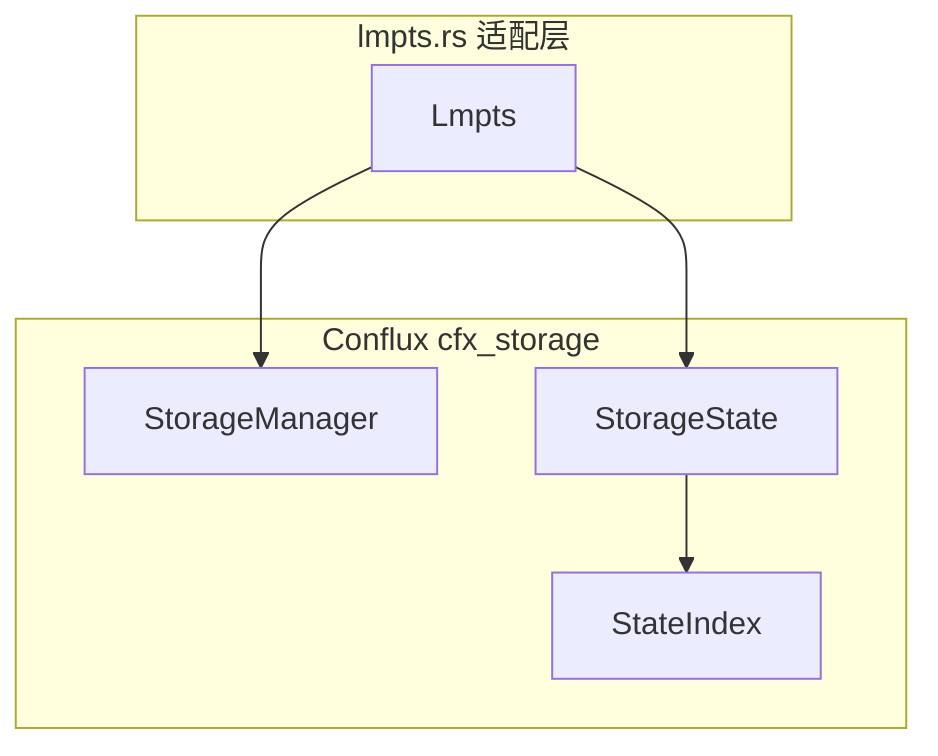

# LMPTs 模块详解

本文档详细介绍 `asb-authdb/src/lmpts.rs` 的实现，该模块集成 Conflux 的 Layered Merkle Patricia Tries。

---

## 模块概览

LMPTs（Layered MPTs）是 Conflux 区块链使用的分层 Merkle Patricia Trie 实现，通过分层存储优化 I/O 性能。



> [!IMPORTANT]
> LMPTs 需要特殊配置才能编译和运行，详见下方说明。

---

## 核心结构

### Lmpts

```rust
pub struct Lmpts {
    manager: Arc<StorageManager>,  // Conflux 存储管理器
    state: StorageState,           // 当前状态句柄
}
```

**设计要点**：
- `StorageManager`：管理多层存储和快照
- `StorageState`：提供状态读写接口

---

## AuthDB Trait 实现

### get - 读取操作

```rust
fn get(&self, key: Vec<u8>) -> Option<Box<[u8]>> {
    let key = StorageKey::AccountKey(key.as_slice());
    self.state.get(key).unwrap()
}
```

使用 `StorageKey::AccountKey` 包装原始 key。

### set - 写入操作

```rust
fn set(&mut self, key: Vec<u8>, value: Vec<u8>) {
    let key = StorageKey::AccountKey(key.as_slice());
    self.state.set(key, value.into_boxed_slice()).unwrap()
}
```

### commit - 提交操作

```rust
fn commit(&mut self, index: usize) {
    // 构造 epoch ID
    let mut epoch_id = H256::default();
    epoch_id.0[0..8].copy_from_slice(index.to_le_bytes().as_ref());
    
    // 计算并提交状态根
    let state_root = self.state.compute_state_root().unwrap();
    self.state.commit(epoch_id).unwrap();
    
    // 获取下一个 epoch 的状态
    let state_index = StateIndex::new_for_next_epoch(
        &epoch_id,
        &state_root,
        index as u64 + 1,
        self.manager.get_storage_manager().get_snapshot_epoch_count(),
    );
    self.state = self.manager
        .get_state_for_next_epoch(state_index)
        .expect("unwrap result")
        .expect("unwrap option")
}
```

**流程**：
1. 将 epoch index 编码为 `H256`
2. 计算状态根
3. 提交当前状态
4. 构造新的 `StateIndex`
5. 获取下一个 epoch 的状态句柄

### backend - 后端访问

```rust
fn backend(&self) -> Option<&dyn KeyValueDB> {
    None  // LMPTs 不暴露底层后端
}
```

LMPTs 内部管理自己的 RocksDB 后端，不通过 `asb-backend` 抽象层。

---

## 特殊配置要求

> [!WARNING]
> LMPTs 存在 RocksDB 依赖冲突，需要手动修改配置。

### 1. 修改 asb-backend/Cargo.toml

注释默认 RocksDB，启用 LMPTs 专用依赖：

```toml
## 注释掉默认配置
# cfx-kvdb-rocksdb = { path = "./cfx-kvdb-rocksdb" }

## 启用 LMPTs 配置
cfx-storage = { git = "https://github.com/Conflux-Chain/conflux-rust.git", rev = "9de2cc9" }
cfx-kvdb-rocksdb = { package="kvdb-rocksdb", git = "https://github.com/Conflux-Chain/conflux-rust.git", rev = "2ee2765" }
```

### 2. 启用 Feature Flag

```bash
cargo build --release --features asb-authdb/lmpts
```

### 3. 限制后端选择

LMPTs 只能使用内置 RocksDB，不支持切换后端：

```rust
// main.rs 中的检查
if options.algorithm == AuthAlgo::LMPTS && options.backend != Backend::RocksDB {
    panic!("LMPTs can not change backend")
}
```

---

## 与 MPT 对比

| 特性 | MPT | LMPTs |
|------|-----|-------|
| 来源 | OpenEthereum | Conflux |
| 后端抽象 | 支持多后端 | 仅内置 RocksDB |
| 分层存储 | 无 | 有（快照层） |
| 编译配置 | 默认可用 | 需手动修改 |
| Feature Flag | 无 | `asb-authdb/lmpts` |

---

## 关键文件

| 文件 | 说明 |
|------|------|
| [lmpts.rs](file:///d:/Dev/authenticated-storage-benchmarks/asb-authdb/src/lmpts.rs) | LMPTs 适配层 |
| [asb-authdb/Cargo.toml](file:///d:/Dev/authenticated-storage-benchmarks/asb-authdb/Cargo.toml) | Feature 定义 |
| [asb-backend/Cargo.toml](file:///d:/Dev/authenticated-storage-benchmarks/asb-backend/Cargo.toml) | 依赖配置说明 |

---

## 使用示例

```bash
# 1. 修改 asb-backend/Cargo.toml（按上述说明）

# 2. 构建
cargo build --release --features asb-authdb/lmpts

# 3. 运行
./target/release/asb-main --no-stat -k 1m -a lmpts
```

---

## 参考文献

> Choi, Jemin Andrew, et al. "LMPTs: Eliminating Storage Bottlenecks for Processing Blockchain Transactions." *IEEE ICBC 2022*.
