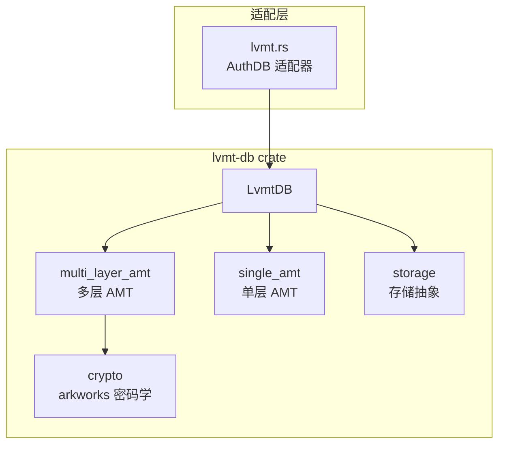

# LVMT 模块详解

本文档详细介绍 `lvmt-db` crate 的实现，这是本项目的**核心研究贡献**：多层版本化多点 Trie（multi-Layer Versioned Multipoint Trie）。

---

## 模块概览

LVMT 是一种新型认证存储结构，结合了多层 AMT（Authenticated Multipoint evaluation Tree）和版本化机制，提供高效的批量状态证明。



---

## 核心结构

### LvmtDB

```rust
pub struct LvmtDB {
    pub kvdb: Arc<dyn KeyValueDB>,    // 后端存储
    pp: Arc<AMTParams<Pairing>>,      // 密码学参数
    tree: VersionTree,                // 版本树
    key_cache: HashMap<Key, KeyValue>, // 键值缓存
    shard_info: Option<(usize, usize)>, // 证明分片信息
    only_merkle_root: bool,           // 是否只维护 Merkle root
}
```

**关键字段**：
- `pp`：Powers of Tau 和 Lagrange 基
- `tree`：多层版本化 AMT
- `shard_info`：证明分片配置

### 存储列（Columns）

```rust
const COL_KEY_OLD: u32 = 0;    // 旧版本键值
const COL_KEY_NEW: u32 = 1;    // 新版本键值
const COL_MERKLE: u32 = 2;     // Merkle 数据
pub const NUM_COLS: u32 = 3;
```

---

## 目录结构

| 目录/文件 | 说明 |
|-----------|------|
| [lvmt_db.rs](file:///d:/Dev/authenticated-storage-benchmarks/asb-authdb/lvmt-db/src/lvmt_db.rs) | 核心 LvmtDB 实现（533 行） |
| [multi_layer_amt/](file:///d:/Dev/authenticated-storage-benchmarks/asb-authdb/lvmt-db/src/multi_layer_amt) | 多层 AMT 实现 |
| [amt/](file:///d:/Dev/authenticated-storage-benchmarks/asb-authdb/lvmt-db/src/amt) | 单层 AMT 实现 |
| [crypto/](file:///d:/Dev/authenticated-storage-benchmarks/asb-authdb/lvmt-db/src/crypto) | arkworks 密码学 |
| [storage/](file:///d:/Dev/authenticated-storage-benchmarks/asb-authdb/lvmt-db/src/storage) | 存储布局抽象 |
| [merkle/](file:///d:/Dev/authenticated-storage-benchmarks/asb-authdb/lvmt-db/src/merkle) | Merkle 证明 |
| [serde/](file:///d:/Dev/authenticated-storage-benchmarks/asb-authdb/lvmt-db/src/serde) | 序列化宏 |

---

## AuthDB Trait 实现

### get - 读取操作

```rust
fn get(&self, key: &Key) -> Result<Option<Box<[u8]>>> {
    // 1. 查询缓存
    // 2. 若未命中，从版本树查找最新版本位置
    // 3. 从 COL_KEY_OLD 或 COL_KEY_NEW 加载值
}
```

### set - 写入操作

```rust
fn set(&mut self, key: &Key, value: Box<[u8]>) {
    // 写入缓存，等待 commit
    self.key_cache.insert(key.clone(), value);
}
```

### commit - 提交操作

```rust
fn commit(&mut self, epoch: u64) -> Result<(G1Projective, H256)> {
    // 1. 遍历缓存中的变更
    // 2. 更新版本树中的键位置
    // 3. 计算新的 AMT commitment
    // 4. 更新 Merkle root
    // 5. 持久化到存储
    // 返回 (AMT commitment, Merkle root)
}
```

---

## 多层版本化架构

```
┌─────────────────────────────────────┐
│           Root Commitment           │
│         (G1 椭圆曲线点)              │
└─────────────────────────────────────┘
                  │
    ┌─────────────┼─────────────┐
    ▼             ▼             ▼
 ┌─────┐      ┌─────┐      ┌─────┐
 │Tree0│      │Tree1│      │Tree2│  ← 多层 AMT
 └─────┘      └─────┘      └─────┘
    │             │             │
    ▼             ▼             ▼
┌───────┐   ┌───────┐   ┌───────┐
│ Nodes │   │ Nodes │   │ Nodes │  ← 版本化节点
└───────┘   └───────┘   └───────┘
```

**版本化机制**：
- 每个 epoch 的状态变更记录版本号
- 支持历史状态查询
- 高效的增量更新

---

## 密码学组件

### 曲线选择

```rust
// 使用 BLS12-381 曲线
pub type Pairing = ark_bls12_381::Bls12_381;
pub type G1<E> = <E as PairingEngine>::G1Projective;
```

### AMT 参数

```rust
pub struct AMTParams<E: PairingEngine> {
    // Powers of Tau (τ^0, τ^1, ..., τ^n)
    // Lagrange 基
    // 商多项式预计算
}
```

参数存储在 `./pp` 目录，首次运行需生成（可能需要数小时）。

---

## 证明系统

### 证明生成

```rust
fn prove(&mut self, key: &Key) -> Result<Proof> {
    // 1. 查找 key 在版本树中的位置
    // 2. 生成 AMT 证明（多项式承诺）
    // 3. 生成 Merkle 证明
    // 返回 (AssociateProof, VecDeque<LevelProof>)
}
```

### 证明验证

```rust
fn verify(
    key: &Key,
    proof: &Proof,
    epoch_root: F,
    pp: &AMTParams<Pairing>,
) -> Result<(), String> {
    // 1. 验证 AMT 多项式承诺
    // 2. 验证 Merkle 路径
}
```

---

## 证明分片

LVMT 支持将证明信息分片到多个验证者：

```rust
// 创建时指定分片
let shard_info = opts.shards.map(|size| (
    size.trailing_zeros() as usize,  // log2(shard_count)
    0                                  // current shard
));
```

命令行：`--shards 16` 表示 16 个分片。

---

## Feature Flags

| Feature | DEPTHS | 说明 |
|---------|--------|------|
| 默认 | 8 | 小规模测试 |
| `medium_lvmt` | 12 | 中等规模 |
| `large_lvmt` | 16 | 大规模（默认启用） |
| `huge_lvmt` | 20 | 超大规模 |

---

## 适配层

[lvmt.rs](file:///d:/Dev/authenticated-storage-benchmarks/asb-authdb/src/lvmt.rs) 将 `LvmtDB` 适配为 `AuthDB`：

```rust
pub struct Lvmt {
    amt: LvmtDB,
    print_root_period: Option<usize>,
}

impl AuthDB for Lvmt {
    fn commit(&mut self, index: usize) {
        let (commit, root) = self.amt.commit(index as u64).unwrap();
        // commit: 椭圆曲线承诺
        // root: Merkle 根哈希
    }
}
```

---

## 指标收集

`LvmtCounter` 收集以下指标：
- `avg_levels`：平均访问层数
- `access_writes`：各列写入次数
- `data_writes`：数据写入次数

---

## 使用示例

```bash
# 创建 pp 目录
mkdir pp

# 运行 LVMT 基准测试
./target/release/asb-main --no-stat -k 1m -a lvmt

# 启用证明分片
./target/release/asb-main --no-stat -k 1m -a lvmt --shards 16

# 打印 root
./target/release/asb-main --no-stat -k 1m -a lvmt --print-root
```

---

## 参考文献

> Chenxing Li, et al. "LVMT: An Efficient Authenticated Storage for Blockchain." *USENIX OSDI 2023*.
