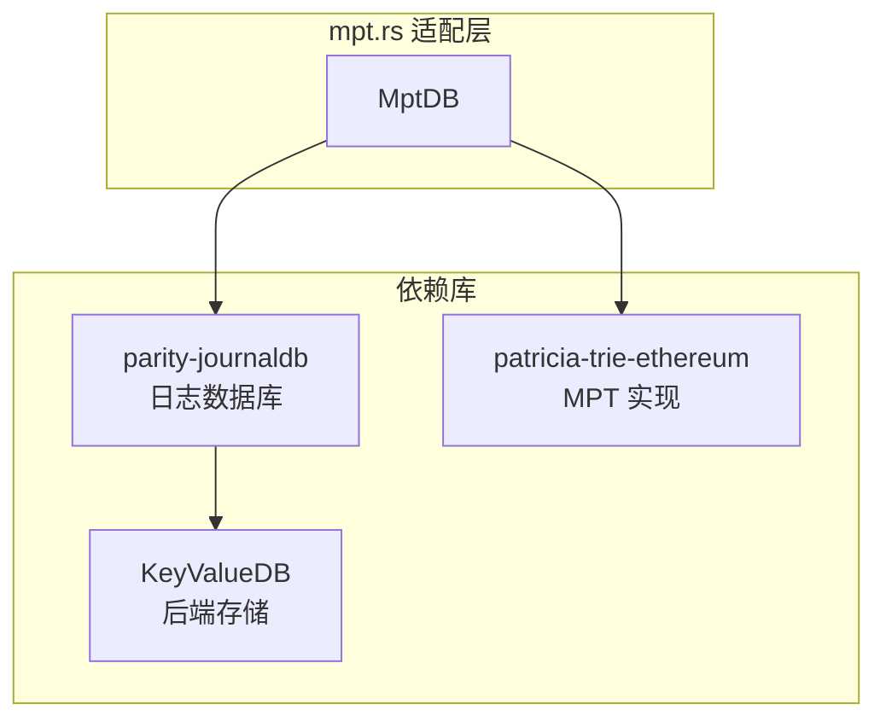
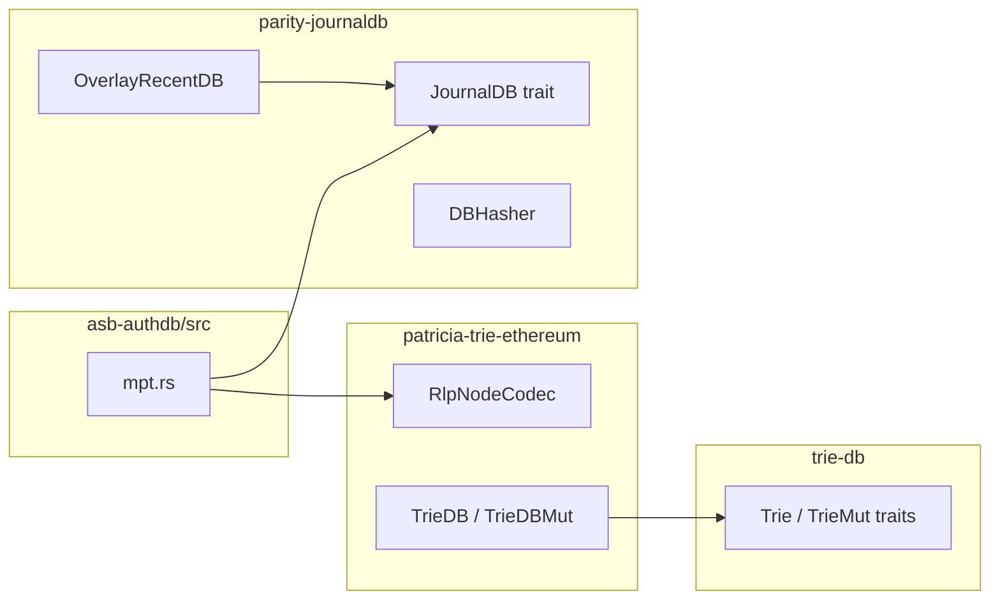

# MPT 模块详解

本文档详细介绍 `asb-authdb/src/mpt.rs` 的实现，该模块将 OpenEthereum 的 Merkle Patricia Trie 适配为 `AuthDB` trait。

---

## 模块概览



---

## 核心结构

### MptDB

```rust
pub struct MptDB {
    backing: Arc<dyn KeyValueDB>,      // 原始后端引用（用于指标）
    db: Arc<RefCell<Box<dyn JournalDB>>>, // JournalDB 包装
    root: H256,                        // 当前 Merkle root
    epoch: usize,                      // 当前 epoch
    print_root_period: Option<usize>,  // root 打印周期
    journal_epoch: usize,              // 日志保留深度
}
```

**设计要点**：
- `JournalDB` 提供状态历史管理，支持回滚
- `root` 保存当前 trie 根哈希
- 使用 `RefCell` 实现内部可变性

---

## 类型别名

```rust
// Keccak 哈希 + RLP 编码的 Trie
pub type TrieDBMut<'db> = trie_db::TrieDBMut<'db, DBHasher, RlpNodeCodec<DBHasher>>;
pub type TrieDB<'db> = trie_db::TrieDB<'db, DBHasher, RlpNodeCodec<DBHasher>>;
```

- `DBHasher`：可配置的哈希器，默认 Keccak256，可切换 Blake2
- `RlpNodeCodec`：以太坊标准的 RLP 节点编码

---

## AuthDB Trait 实现

### get - 读取操作

```rust
fn get(&self, key: Vec<u8>) -> Option<Box<[u8]>> {
    let db = self.db.borrow();
    let hash_db = &db.as_hash_db();
    let trie = TrieDB::new(hash_db, &self.root).unwrap();
    trie.get(key.as_slice()).unwrap().map(|x| x.into_vec().into_boxed_slice())
}
```

**流程**：
1. 借用 JournalDB 引用
2. 转换为 `HashDB` 接口
3. 从当前 root 构造只读 Trie
4. 执行 trie 查询

### set - 写入操作

```rust
fn set(&mut self, key: Vec<u8>, value: Vec<u8>) {
    let mut db = self.db.borrow_mut();
    let hash_db = db.as_hash_db_mut();
    let mut trie = TrieDBMut::from_existing(hash_db, &mut self.root).unwrap();
    trie.insert(key.as_slice(), value.as_slice()).unwrap();
}
```

**流程**：
1. 获取可变借用
2. 从当前 root 构造可变 Trie
3. 插入键值对，自动更新 root

### commit - 提交操作

```rust
fn commit(&mut self, index: usize) {
    self.epoch = index;
    let mut batch = DBTransaction::new();
    let mut db = self.db.borrow_mut();
    
    // 记录当前 epoch 到日志
    db.journal_under(&mut batch, index as u64, &epoch_hash(index)).unwrap();
    
    // 标记旧 epoch 为 canonical
    if let Some(old_index) = index.checked_sub(self.journal_epoch) {
        db.mark_canonical(&mut batch, old_index as u64, &epoch_hash(old_index)).unwrap();
    }
    
    db.backing().write(batch).unwrap();
    db.flush();
}
```

**JournalDB 工作机制**：
- `journal_under`：将当前状态变更记录到日志
- `mark_canonical`：标记旧状态为正式状态，允许清理

### flush_all - 最终刷新

```rust
fn flush_all(&mut self) {
    let mut batch = DBTransaction::new();
    let mut db = self.db.borrow_mut();
    
    // 标记所有待处理 epoch 为 canonical
    for i in (0..self.journal_epoch).into_iter().rev() {
        let index = self.epoch - i;
        db.mark_canonical(&mut batch, index as u64, &epoch_hash(index)).unwrap();
    }
    
    // 持久化当前 root
    batch.ops.push(DBOp::Insert {
        col: 0,
        key: DBKey::from_slice(&[0u8; 256]),
        value: self.root.to_keyed_vec(&[]),
    });
    
    db.backing().write(batch).unwrap();
    db.flush();
}
```

---

## JournalDB 算法

本模块使用 `Algorithm::OverlayRecent`：

| 算法 | 说明 |
|------|------|
| Archive | 保留所有历史，不修剪 |
| EarlyMerge | 写入后端，日志记录新旧状态 |
| **OverlayRecent** | 写入内存覆盖层，历史结束后刷新到后端 |
| RefCounted | 引用计数管理状态 |

`OverlayRecent` 特点：
- 写入先进入内存 overlay
- 读取时先查 overlay，再查后端
- 历史窗口结束后批量刷新

---

## 性能指标收集

### MptCounter

```rust
pub struct MptCounter {
    journal_db: Arc<RefCell<Box<dyn JournalDB>>>,
}

impl CounterTrait for MptCounter {
    fn report(&mut self) -> String {
        let mut sizes = BTreeMap::new();
        self.journal_db.borrow().get_sizes(&mut sizes);
        format!("Recent backing size: {}", 
            sizes.get("db_overlay_recent_backing_size").unwrap())
    }
}
```

**报告内容**：
- `db_overlay_recent_backing_size`：overlay 层缓存大小

---

## 依赖关系



---

## 关键文件

| 文件 | 说明 |
|------|------|
| [mpt.rs](file:///d:/Dev/authenticated-storage-benchmarks/asb-authdb/src/mpt.rs) | MPT 适配层 |
| [patricia-trie-ethereum/src/lib.rs](file:///d:/Dev/authenticated-storage-benchmarks/asb-authdb/patricia-trie-ethereum/src/lib.rs) | Trie 类型别名 |
| [parity-journaldb/src/lib.rs](file:///d:/Dev/authenticated-storage-benchmarks/asb-authdb/parity-journaldb/src/lib.rs) | JournalDB 入口 |
| [overlayrecentdb.rs](file:///d:/Dev/authenticated-storage-benchmarks/asb-authdb/parity-journaldb/src/overlayrecentdb.rs) | OverlayRecent 实现 |

---

## 使用示例

```bash
# 运行 MPT 基准测试
./target/release/asb-main --no-stat -k 1m -a mpt

# 启用 root 打印
./target/release/asb-main --no-stat -k 1m -a mpt --print-root
```
