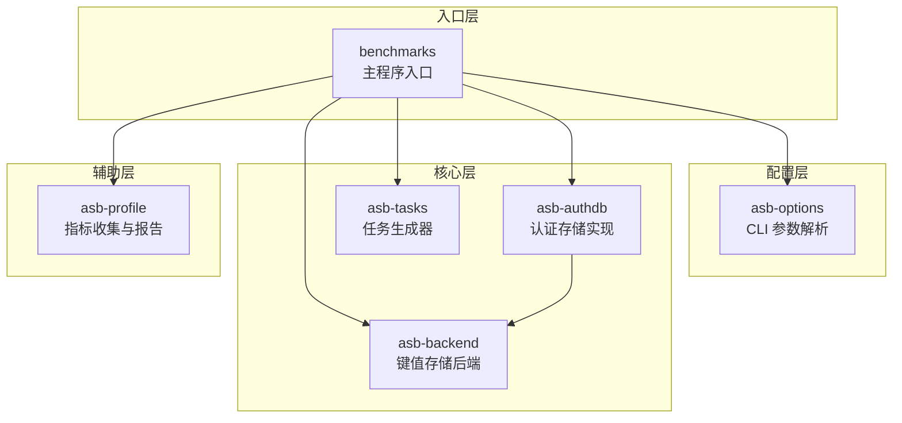
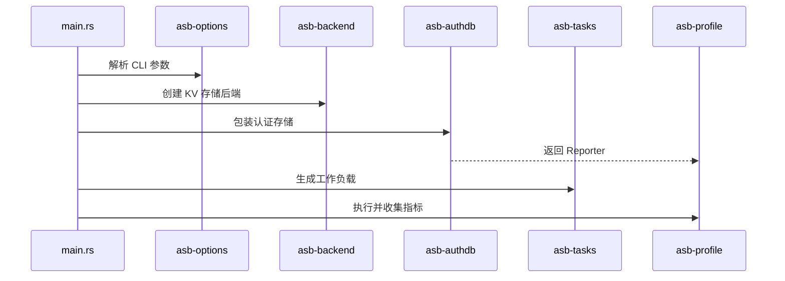
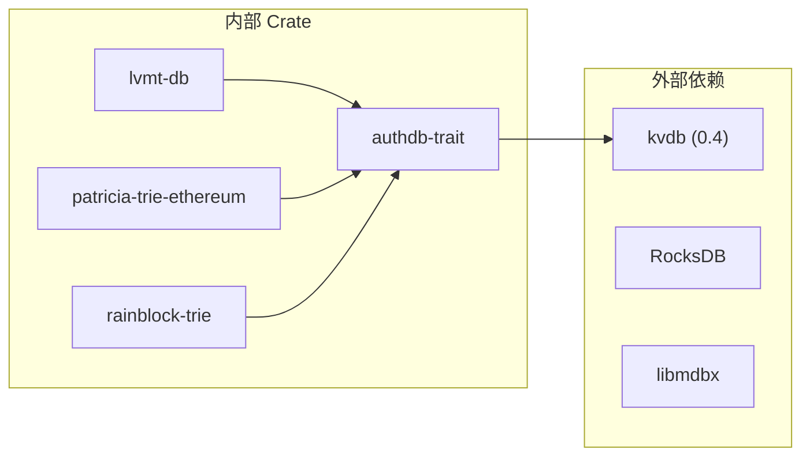

# Authenticated Storage Benchmarks 仓库结构详解

本文档详细介绍 `authenticated-storage-benchmarks` 仓库的架构设计、模块组织和数据流。

---

## 项目概览

该仓库是一个模块化基准测试工具，用于评估区块链认证存储系统性能。采用 Cargo workspace 组织，包含 6 个主要 crate。



---

## 数据流



---

## Crate 详解

### 1. benchmarks（主程序）

程序入口，协调各模块协作。

| 文件 | 说明 |
|------|------|
| [main.rs](file:///d:/Dev/authenticated-storage-benchmarks/benchmarks/src/main.rs) | 入口函数，解析参数、初始化组件、启动基准测试 |
| [run.rs](file:///d:/Dev/authenticated-storage-benchmarks/benchmarks/src/run.rs) | 核心执行逻辑：`warmup()` 预热、`run_tasks()` 执行任务循环 |

**主要流程**：
1. 解析 CLI 参数 → `Options::from_args()`
2. 创建数据库目录 → 可选从 warmup 目录复制
3. 初始化后端 → `asb_backend::backend()`
4. 包装认证存储 → `asb_authdb::new()`
5. 生成任务 → `asb_tasks::tasks()`
6. 执行基准测试 → `run_tasks()`

---

### 2. asb-options（CLI 参数）

基于 `structopt` 的命令行参数解析。

| 文件 | 说明 |
|------|------|
| [lib.rs](file:///d:/Dev/authenticated-storage-benchmarks/asb-options/src/lib.rs) | `Options` 结构体及参数解析函数 |

**关键类型**：

```rust
pub struct Options {
    pub algorithm: AuthAlgo,    // -a: 认证算法
    pub backend: Backend,       // -b: 后端选择
    pub total_keys: usize,      // -k: 键数量
    pub epoch_size: usize,      // 每 epoch 操作数
    pub real_trace: bool,       // 使用真实 trace
    pub no_stat: bool,          // 禁用后端统计
    pub shards: Option<usize>,  // LVMT 分片数
    // ...
}

pub enum AuthAlgo {
    RAW, AMT(usize), LVMT, MPT, LMPTS, RAIN
}

pub enum Backend {
    RocksDB, InMemoryDB, MDBX
}
```

---

### 3. asb-backend（键值存储后端）

抽象层，统一不同 KV 存储的接口。

| 文件 | 说明 |
|------|------|
| [lib.rs](file:///d:/Dev/authenticated-storage-benchmarks/asb-backend/src/lib.rs) | `backend()` 工厂函数 |
| [cfx_kvdb_rocksdb.rs](file:///d:/Dev/authenticated-storage-benchmarks/asb-backend/src/cfx_kvdb_rocksdb.rs) | Conflux 版 RocksDB 封装 |
| [parity_kvdb_rocksdb.rs](file:///d:/Dev/authenticated-storage-benchmarks/asb-backend/src/parity_kvdb_rocksdb.rs) | Parity 版 RocksDB 封装 |
| [mdbx.rs](file:///d:/Dev/authenticated-storage-benchmarks/asb-backend/src/mdbx.rs) | MDBX 数据库封装 |
| [db_with_mertics.rs](file:///d:/Dev/authenticated-storage-benchmarks/asb-backend/src/db_with_mertics.rs) | 带指标收集的数据库包装器 |
| [in_mem_with_metrics.rs](file:///d:/Dev/authenticated-storage-benchmarks/asb-backend/src/in_mem_with_metrics.rs) | 内存数据库封装 |

**接口**：实现 `kvdb::KeyValueDB` trait，返回 `Arc<dyn KeyValueDB>`。

---

### 4. asb-authdb（认证存储实现）

核心模块，提供多种认证存储算法实现。

#### 目录结构

```
asb-authdb/
├── src/                      # 算法适配层
├── authdb-trait/             # AuthDB trait 定义
├── lvmt-db/                  # LVMT 核心实现
├── patricia-trie-ethereum/   # OpenEthereum MPT
├── rainblock-trie/           # RainBlock MPT 变体
├── parity-journaldb/         # 日志数据库
└── blake2-hasher/            # Blake2 哈希器
```

#### 核心 Trait

定义于 [authdb-trait/src/lib.rs](file:///d:/Dev/authenticated-storage-benchmarks/asb-authdb/authdb-trait/src/lib.rs)：

```rust
pub trait AuthDB {
    fn get(&self, key: Vec<u8>) -> Option<Box<[u8]>>;
    fn set(&mut self, key: Vec<u8>, value: Vec<u8>);
    fn commit(&mut self, index: usize);
    fn flush_all(&mut self) {}
    fn backend(&self) -> Option<&dyn KeyValueDB>;
}
```

#### 算法实现

| 文件 | 算法 | 说明 |
|------|------|------|
| [raw.rs](file:///d:/Dev/authenticated-storage-benchmarks/asb-authdb/src/raw.rs) | RAW | 直接写入后端，无认证 |
| [mpt.rs](file:///d:/Dev/authenticated-storage-benchmarks/asb-authdb/src/mpt.rs) | MPT | OpenEthereum Merkle Patricia Trie |
| [lvmt.rs](file:///d:/Dev/authenticated-storage-benchmarks/asb-authdb/src/lvmt.rs) | LVMT | 多层版本化多点 Trie（研究贡献） |
| [amt.rs](file:///d:/Dev/authenticated-storage-benchmarks/asb-authdb/src/amt.rs) | AMT | 单层 Authenticated Multipoint Tree |
| [rain_mpt.rs](file:///d:/Dev/authenticated-storage-benchmarks/asb-authdb/src/rain_mpt.rs) | RAIN | RainBlock MPT 变体 |
| [lmpts.rs](file:///d:/Dev/authenticated-storage-benchmarks/asb-authdb/src/lmpts.rs) | LMPTS | Conflux 分层 MPT（feature-gated） |

#### 工厂函数

[lib.rs](file:///d:/Dev/authenticated-storage-benchmarks/asb-authdb/src/lib.rs) 中的 `new()` 函数根据 `Options.algorithm` 创建对应实现。

---

### 5. asb-tasks（任务生成器）

生成基准测试工作负载。

| 文件 | 说明 |
|------|------|
| [lib.rs](file:///d:/Dev/authenticated-storage-benchmarks/asb-tasks/src/lib.rs) | `TaskTrait` trait 及工厂函数 |
| [read_then_write.rs](file:///d:/Dev/authenticated-storage-benchmarks/asb-tasks/src/read_then_write.rs) | 随机读写任务生成器 |
| [real_trace.rs](file:///d:/Dev/authenticated-storage-benchmarks/asb-tasks/src/real_trace.rs) | 真实以太坊 trace 任务 |

**核心 Trait**：

```rust
pub trait TaskTrait {
    fn warmup<'a>(&'a self) -> Box<dyn Iterator<Item = Events> + 'a>;
    fn tasks<'a>(&'a self) -> Box<dyn Iterator<Item = Events> + 'a>;
}

pub enum Event {
    Read(Key),
    Write(Key, Value),
}
```

---

### 6. asb-profile（性能分析）

收集和报告基准测试指标。

| 文件 | 说明 |
|------|------|
| [lib.rs](file:///d:/Dev/authenticated-storage-benchmarks/asb-profile/src/lib.rs) | 模块导出 |
| [counter.rs](file:///d:/Dev/authenticated-storage-benchmarks/asb-profile/src/counter.rs) | `Reporter` 和 `CounterTrait` |
| [profiler.rs](file:///d:/Dev/authenticated-storage-benchmarks/asb-profile/src/profiler.rs) | pprof 集成 |

**核心类型**：

```rust
pub struct Reporter<'a> {
    start_time: Instant,
    total_read_count: usize,
    total_write_count: usize,
    counter: Box<dyn CounterTrait>,
    // ...
}

pub trait CounterTrait {
    fn reset(&mut self) {}
    fn report(&mut self) -> String { "".to_string() }
}
```

**指标输出**：
- 每 `report_epoch` 个 epoch 输出一次
- 包含：ops/s、us/op、读写放大率、空读计数等

---

## 关键依赖关系



---

## Feature Flags

| Feature | Crate | 说明 |
|---------|-------|------|
| `light-hash` | asb-authdb | 用 blake2b 替代 keccak256 |
| `thread-safe` | asb-authdb | RainBlock MPT 线程安全模式 |
| `lmpts` | asb-authdb | 启用 LMPTs 支持 |
| `parity-backend` | asb-backend | 使用 Parity 版 RocksDB |
| `lmpts-backend` | asb-backend | LMPTs 专用后端 |
| `large_lvmt` | lvmt-db | 大规模 LVMT 配置 |

---

## 典型使用流程

```bash
# 1. 构建项目
cargo build --release

# 2. 运行 MPT 基准测试（100 万键）
./target/release/asb-main --no-stat -k 1m -a mpt

# 3. 运行 LVMT 基准测试（带分片）
./target/release/asb-main --no-stat -k 1m -a lvmt --shards 16

# 4. 使用真实 trace
./target/release/asb-main --no-stat -a lvmt --real-trace

# 5. 批量运行预配置实验
python3 run.py
```

---

## 文件快速导航

| 用途 | 路径 |
|------|------|
| 程序入口 | [benchmarks/src/main.rs](file:///d:/Dev/authenticated-storage-benchmarks/benchmarks/src/main.rs) |
| 执行循环 | [benchmarks/src/run.rs](file:///d:/Dev/authenticated-storage-benchmarks/benchmarks/src/run.rs) |
| CLI 参数 | [asb-options/src/lib.rs](file:///d:/Dev/authenticated-storage-benchmarks/asb-options/src/lib.rs) |
| 后端工厂 | [asb-backend/src/lib.rs](file:///d:/Dev/authenticated-storage-benchmarks/asb-backend/src/lib.rs) |
| AuthDB trait | [asb-authdb/authdb-trait/src/lib.rs](file:///d:/Dev/authenticated-storage-benchmarks/asb-authdb/authdb-trait/src/lib.rs) |
| 算法工厂 | [asb-authdb/src/lib.rs](file:///d:/Dev/authenticated-storage-benchmarks/asb-authdb/src/lib.rs) |
| 任务生成 | [asb-tasks/src/lib.rs](file:///d:/Dev/authenticated-storage-benchmarks/asb-tasks/src/lib.rs) |
| 指标报告 | [asb-profile/src/counter.rs](file:///d:/Dev/authenticated-storage-benchmarks/asb-profile/src/counter.rs) |
| Workspace 配置 | [Cargo.toml](file:///d:/Dev/authenticated-storage-benchmarks/Cargo.toml) |
