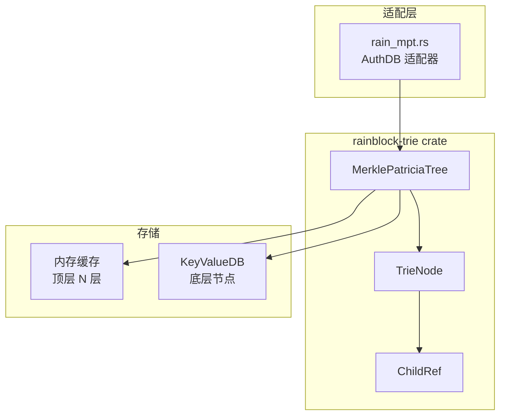

# RainBlock-Trie 模块详解

本文档详细介绍 `rainblock-trie` crate 的实现，这是本仓库**原创实现**的 Merkle Patricia Trie 变体。

---

## 模块概览

RainBlock-Trie 基于 RainBlock 论文的思想，将 trie 的顶层节点缓存在内存中，底层节点存储在磁盘，以优化 I/O 性能。



---

## 核心结构

### MerklePatriciaTree

```rust
pub struct MerklePatriciaTree<const TOP_LAYER_DEPTH: usize> {
    pub db: Arc<dyn KeyValueDB>,      // 后端存储
    root: Option<NodePtr>,            // 根节点指针
    del_ops: Vec<H256>,               // 待删除的节点哈希
    loaded_node: Vec<NodePtrWeak>,    // 从磁盘加载的节点
    exile_nodes: Vec<NodePtrWeak>,    // 需要持久化的节点
}
```

**泛型参数**：
- `TOP_LAYER_DEPTH`：内存缓存的层数，默认为 6

### TrieNode

```rust
enum TrieNode {
    Branch {
        children: ChildRefGroup,  // 16 个子节点引用
        value: Vec<u8>,           // 可选的节点值
    },
    Extension {
        key: Vec<Nibble>,         // 压缩路径
        child: ChildRef,          // 子节点引用
    },
    Leaf {
        key: Vec<Nibble>,         // 剩余路径
        value: Vec<u8>,           // 叶节点值
    },
}
```

### ChildRef

```rust
enum ChildRef {
    Null,                    // 空引用
    Owned(NodePtr),          // 内存中的节点
    Lazy(H256, Cell<...>),   // 延迟加载的节点
}
```

---

## 文件结构

| 文件 | 说明 |
|------|------|
| [lib.rs](file:///d:/Dev/authenticated-storage-benchmarks/asb-authdb/rainblock-trie/src/lib.rs) | 模块入口，导出 `MerklePatriciaTree` |
| [rain_mpt.rs](file:///d:/Dev/authenticated-storage-benchmarks/asb-authdb/rainblock-trie/src/rain_mpt.rs) | 核心 MPT 实现（559 行） |
| [trie_node.rs](file:///d:/Dev/authenticated-storage-benchmarks/asb-authdb/rainblock-trie/src/trie_node.rs) | TrieNode 枚举定义 |
| [trie_node_ext.rs](file:///d:/Dev/authenticated-storage-benchmarks/asb-authdb/rainblock-trie/src/trie_node_ext.rs) | TrieNode 扩展方法 |
| [child_ref.rs](file:///d:/Dev/authenticated-storage-benchmarks/asb-authdb/rainblock-trie/src/child_ref.rs) | ChildRef 和 ChildRefGroup |
| [nibble.rs](file:///d:/Dev/authenticated-storage-benchmarks/asb-authdb/rainblock-trie/src/nibble.rs) | Nibble（半字节）处理 |
| [thread_safe.rs](file:///d:/Dev/authenticated-storage-benchmarks/asb-authdb/rainblock-trie/src/thread_safe.rs) | Arc 版本节点指针 |
| [thread_non_safe.rs](file:///d:/Dev/authenticated-storage-benchmarks/asb-authdb/rainblock-trie/src/thread_non_safe.rs) | Rc 版本节点指针 |

---

## 核心算法

### Search - 路径搜索

```rust
fn search(&mut self, key: Vec<u8>) -> SearchResult {
    // 从根节点开始遍历
    // 返回搜索栈、匹配状态、剩余路径
}
```

返回 `SearchResult` 包含：
- `stack`：遍历路径上的节点栈
- `matched`：是否完全匹配
- `remainder`：未匹配的剩余路径

### Put - 插入操作

```rust
pub fn put(&mut self, key: Vec<u8>, val: Vec<u8>) {
    // 1. 搜索插入位置
    // 2. reset_pointers：断开待修改路径
    // 3. 执行插入（branch/extension/leaf）
    // 4. recover_pointers：重建路径
}
```

插入策略根据终止节点类型：
- `insert_on_branch`：在分支节点插入
- `insert_on_extension`：分裂扩展节点
- `insert_on_leaf`：分裂叶节点

### Commit - 提交操作

```rust
pub fn commit(&mut self) -> io::Result<H256> {
    // 1. 收集 exile_nodes（超出缓存层的节点）
    // 2. 从根节点递归提交
    // 3. 截断内存中过深的节点
    // 4. 删除过期节点
    // 5. 写入新节点
    // 6. 更新根哈希
}
```

---

## 分层缓存机制

```
         Root (层 0)
           │
     ┌─────┼─────┐
     ▼     ▼     ▼
   Branch(层 1)...
     │
   ┌─┴─┐
   ▼   ▼
  ...  ...
           ← TOP_LAYER_DEPTH = 6 (内存)
─────────────────────────────────
           ← 以下节点存储在磁盘
    Lazy(H256)
```

- 顶层 N 层节点保持在内存
- 超出深度的节点存储为 `ChildRef::Lazy(H256)`
- 访问时按需加载

---

## 适配层

[rain_mpt.rs](file:///d:/Dev/authenticated-storage-benchmarks/asb-authdb/src/rain_mpt.rs) 将 `MerklePatriciaTree` 适配为 `AuthDB`：

```rust
const CACHED_LEVEL: usize = 6;

pub struct RainMpt(
    RwLock<MerklePatriciaTree<CACHED_LEVEL>>,
    Arc<dyn KeyValueDB>,
);

impl AuthDB for RainMpt {
    fn get(&self, key: Vec<u8>) -> Option<Box<[u8]>> {
        self.0.write().unwrap().get(key).map(Vec::into_boxed_slice)
    }
    fn set(&mut self, key: Vec<u8>, value: Vec<u8>) {
        self.0.write().unwrap().put(key, value);
    }
    fn commit(&mut self, _index: usize) {
        self.0.write().unwrap().commit().unwrap();
    }
}
```

---

## Feature Flags

| Feature | 说明 |
|---------|------|
| `light-hash` | 使用 Blake2b 替代 Keccak256 |
| `thread-safe` | 使用 `Arc` 替代 `Rc`，支持多线程 |

---

## 与原始 RainBlock 的差异

| 特性 | 原始 RainBlock | 本实现 |
|------|--------------|--------|
| 存储位置 | 分布式内存系统 | 本地 KeyValueDB |
| 顶层缓存 | 分布式节点 | 本地内存 |
| 底层存储 | 分布式存储 | 本地磁盘 |

---

## 使用示例

```bash
# 运行 RainBlock-Trie 基准测试
./target/release/asb-main --no-stat -k 1m -a rain

# 启用线程安全模式
cargo build --release --features asb-authdb/thread-safe
./target/release/asb-main --no-stat -k 1m -a rain

# 使用 Blake2b 哈希
cargo build --release --features asb-authdb/light-hash
```

---

## 参考文献

> Ponnapalli, Soujanya, et al. "RainBlock: Faster Transaction Processing in Public Blockchains." *USENIX ATC 2021*.
